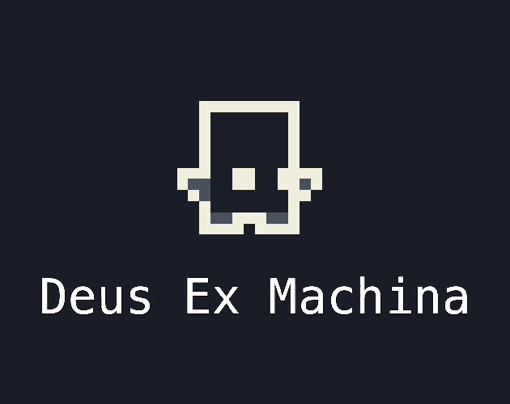

<p align="center">
  
</p>

# Deus Ex Machina

[](https://github.com/remarkablegames/deus-ex-machina/releases)
[](https://github.com/remarkablegames/deus-ex-machina/actions/workflows/build.yml)

🔚 <kbd>Deus Ex Machina</kbd> is a puzzle-platformer where you play as the _"god in the machine"_, drawing and manipulating arrows to guide a robot through treacherous industrial levels.

> _Guide the machine. Become the god._

The game features a robot/player character that auto-walks through levels, and you must strategically place directional arrows (with limited resources) to navigate spikes, gaps, and obstacles.

The title plays on the Latin phrase _deus ex machina_—literally "god from the machine"—referencing both the player's omniscient role in manipulating the game world and the industrial/robotic theme.

Play the game on:

- [Wavedash](https://wavedash.com/games/deus-ex-machina)
- [itch.io](https://remarkablegames.itch.io/deus-ex-machina)
- [remarkablegames](https://remarkablegames.org/deus-ex-machina/)

Read the [blog post](https://remarkablegames.org/posts/deus-ex-machina/).

## Features

- Puzzle-platformer gameplay: draw arrows to guide a robot through levels
- Rotate and erase arrows/blocks with limited arrows on select levels
- Restart the current level by pressing `R`
- Mobile support:
  - Touch toolbar with Pan, Place, Rotate, Erase, and Restart
  - Draggable toolbar with a `≡` handle
  - Pinch-to-zoom and drag-to-pan camera controls
  - Landscape orientation lock and mobile-friendly level hints

## How to Play

- Left-click to draw an arrow
  - Left-click an arrow to rotate it
  - Some levels limit the number of arrows you can place
- Right-click to erase a block
  - Some blocks are permanent
- Avoid the spikes
- Reach the orb to win
- Press "R" to restart the level

## Credits

- [Victor H (Music Composer)](https://vhsm3.itch.io/)
- [Mark (Programmer)](https://github.com/remarkablemark)
- [16x16 Industrial Tileset](https://0x72.itch.io/16x16-industrial-tileset)
- [Kenney Interface Sounds](https://kenney.nl/assets/interface-sounds)
- [Menu SFX Pack](https://hitrison.itch.io/menu-sfx-pack)
- [Typewriter Machine](https://pixabay.com/sound-effects/film-special-effects-typewriter-machine-64191/)

## Prerequisites

[nvm](https://github.com/nvm-sh/nvm#installing-and-updating):

```sh
brew install nvm
```

## Install

Clone the repository:

```sh
git clone https://github.com/remarkablegames/deus-ex-machina.git
cd deus-ex-machina
```

Install the dependencies:

```sh
npm install
```

## Environment Variables

Update the environment variables:

```sh
cp .env .env.local
```

Update the **Secrets** in the repository **Settings**.

## Available Scripts

In the project directory, you can run:

### `npm start`

Runs the game in the development mode.

Open [http://localhost:5173](http://localhost:5173) to view it in the browser.

The page will reload if you make edits.

You will also see any errors in the console.

### `npm run build`

Builds the game for production to the `dist` folder.

It correctly bundles in production mode and optimizes the build for the best performance.

The build is minified and the filenames include the hashes.

Your game is ready to be deployed!

### `npm run bundle`

Builds the game and compresses the contents into a ZIP archive in the `dist` folder.

Your game can be uploaded to your server, [itch.io](https://itch.io/), [newgrounds](https://www.newgrounds.com/), etc.

## Testing

### Level

To start the game at a specific level, append the `?level=` querystring parameter to the URL with a zero-based index:

```
http://localhost:5173/?level=0
```
